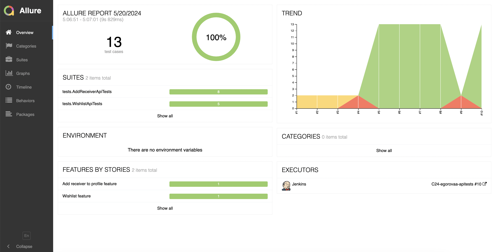
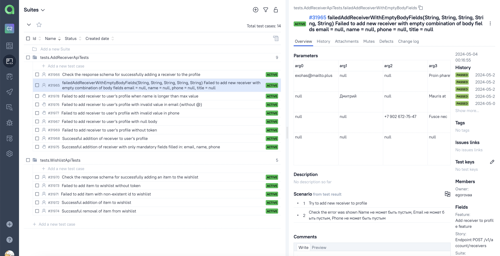

# Test Automation Project for [Республика](https://www.respublica.ru/)
<p align="center">  </p>

## **Contents:** ##
* <a href="#tools">Technologies and tools</a>

* <a href="#cases">Examples of automated test cases</a>

* <a href="#jenkins">Build in Jenkins</a>

* <a href="#console">Run from Terminal</a>

* <a href="#allure">Allure report</a>

* <a href="#testops">Integration with Allure TestOps</a>

* <a href="#jira">Integration with Jira</a>

* <a href="#telegram">Telegram notification with bot</a>

-----
<a id="tools"></a>
## <a name="Technologies and tools">**Technologies and tools:**</a>

<p align="center">
<a href="https://www.w3schools.com/java/">  </a> 
<a href="https://www.jetbrains.com/idea/">  </a> 
<a href="https://git-scm.com/">  </a> 
<a href="https://junit.org/junit5">  </a>
<a href="https://rest-assured.io/">  </a>
<a href="https://gradle.org">  </a>
<a href="https://allurereport.org/">  </a>
<a href="https://qameta.io/">  </a>
<a href="https://www.jenkins.io">  </a>
<a href="https://www.atlassian.com/software/jira">  </a>
</p>

- The API autotests were written in **Java**.
- **Gradle** was used as the builder.
- **JUnit 5** and **REST-assured** were used as test frameworks.
- For remote run, a job in **Jenkins** with **Allure report** generation and result sending to **Telegram** using a bot has been implemented.
- Integration with **Allure TestOps** and **Jira** has been established.

----
<a id="cases"></a>
## **Examples of automated test cases:**
**Add receiver feature - endpoint POST /v1/account/receivers**
- ✅ Checking that the recipient is successfully added to the user profile
- ✅ Pairwise checking combinations of empty string body fields that cause an error
- ✅ An error is received when sending a null body
- ✅ An error is received when sending request without token in headers
- ✅ Checking the JSON schema of the response to a successfully executed request

**Add/remove from wishlist feature - endpoint GET /v1/account/wishes/add_or_remove_wish_item/<item_id>**
- ✅ Checking that the item is successfully added to the withlist
- ✅ Checking that the item is successfully removed from the withlist
- ✅ An error is received when sending a non-existent <item_id>
- ✅ An error is received when sending a request without a token in the headers
- ✅ Checking the JSON schema of the response to a successfully executed request

----
<a id="jenkins"></a>
## Build in Jenkins ([link](https://jenkins.autotests.cloud/job/C24-egorovaa-apitests/))
<p align="center">  
<a href="https://jenkins.autotests.cloud/job/C24-egorovaa-apitests/"></a>  
</p>

### **Jenkins build options:**

- `PASSWORD` (no default value)
- `EMAIL` (no default value)
- `BASE_PATH` (default path - /api)
- `BASE_URI` (default uri - https://api.respublica.ru)
- `COMMENT` (default - Respublica api test results)


----
<a id="console"></a>
## Run from Terminal

**Local launch**
```bash  
gradle clean test
```

**Remote launch via Jenkins**
```bash
clean test
-DbaseUrl=${BASE_URI}
-DbasePath=${BASE_PATH}
-Demail=${EMAIL}
-Dpassword=${PASSWORD}
```


----
<a id="allure"></a>
## Allure report ([link](https://jenkins.autotests.cloud/job/C24-egorovaa-apitests/allure/))

**Main report page**
<p align="center">  
<a href="https://jenkins.autotests.cloud/job/C24-egorovaa-apitests/allure/"></a>  
</p>

**Test cases**
<p align="center">  
<a href="https://jenkins.autotests.cloud/job/C24-egorovaa-apitests/allure/"></a>  
</p>


----
<a id="testops"></a>
## Integration with Allure TestOps ([link](https://allure.autotests.cloud/project/4213/dashboards))
<p align="center">  
<a href="https://allure.autotests.cloud/project/4213/dashboards"></a>  
</p>

**Manual test cases**
<p align="center">  
<a href="https://allure.autotests.cloud/project/4213/dashboards"></a>  
</p>

**Automation test cases**
<p align="center">  
<a href="https://allure.autotests.cloud/project/4213/dashboards"></a>  
</p>

----
<a id="jira"></a>
## Integration with Jira ([link](https://jira.autotests.cloud/browse/HOMEWORK-1211))
<p align="center">  
<a href="https://jira.autotests.cloud/browse/HOMEWORK-1211"></a>  
</p>

----
<a id="telegram"></a>
## Telegram notification with bot
<p align="center">  
 
</p>
